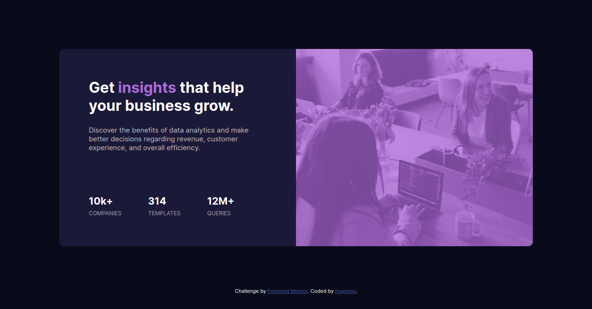

# Frontend Mentor - Stats preview card component solution

This is a solution to the [Stats preview card component challenge on Frontend Mentor](https://www.frontendmentor.io/challenges/stats-preview-card-component-8JqbgoU62). Frontend Mentor challenges help you improve your coding skills by building realistic projects.

## Table of contents

- [Overview](#overview)
  - [The challenge](#the-challenge)
  - [Screenshot](#screenshot)
  - [Links](#links)
- [My process](#my-process)
  - [Built with](#built-with)
  - [What I learned](#what-i-learned)
  - [Continued development](#continued-development)
  - [Useful resources](#useful-resources)
- [Author](#author)
- [Acknowledgments](#acknowledgments)

**Note: Delete this note and update the table of contents based on what sections you keep.**

## Overview

### The challenge

Users should be able to:

- View the optimal layout depending on their device's screen size

### Screenshot

### Links

- Solution URL: [Solutions](https://www.frontendmentor.io/solutions/mobile-first-using-scss-grid-and-flexbox-MT8M4IP2a)
- Live Site URL: [Live](https://mupinnn.github.io/stats-preview-card-component/)

## My process

### Built with

- SCSS
- Flexbox
- CSS Grid
- Mobile-first workflow

### What I learned

I'm finding easy and simple way to create image overlay without adding empty div. Just use CSS `::after` pseudo-element selector, and fit it with the image container size.

### Continued development

For future projects, I'm still curious and want to dig dive more about grid and flexbox, creating asymmetrical layout, etc. BEM, and other methodologies packed to my learning list too!

## Author

- Website - [Faqih](https://mupinnn.githu.io)
- Frontend Mentor - [@mupinnn](https://www.frontendmentor.io/profile/mupinnn)
- Twitter - [@itsmupinnn](https://www.twitter.com/itsmupinnn)
